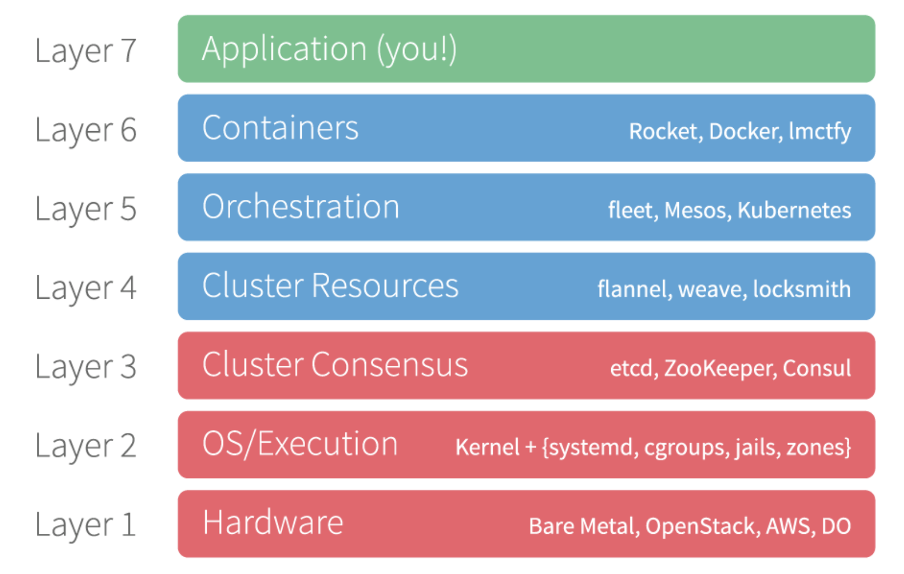
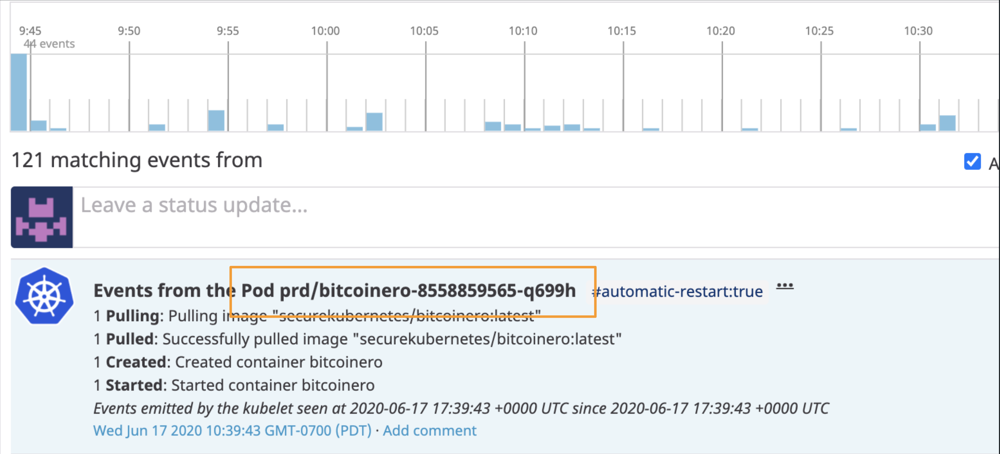

# Securing Apps & Data at Scale: Kill Chains in K8s

## Security & Kubernetes
Kubernetes is dominating the container orchestration market. A State of Kubernetes and Container Security report found that 87 percent of organizations are using Kubernetes. 

According to a report by StackRox, security concerns are inhibiting business innovation. 44% of respondents acknowledge they’ve slowed or halted deploying applications into production because of security concerns, meaning these companies are not fully benefiting from the primary advantage – faster app delivery – of moving to containers.

Nearly everyone has experienced a security incident. 
* 94% of respondents have experienced a security incident in their environments in 2019. Data breaches and exposures often result from human error. 
* 69% of respondents have experienced a misconfiguration incident, 27% reported a runtime incident, and 24% have had a major vulnerability to remediate

L4 

### Containers and the OSI model
Where do containers and Kubernetes fit in the OSI model? Below is a figure that shows the relationship.

## Presentation

[The Project: "Kill Chains" in Kubernetes](https://docs.google.com/presentation/d/1xQrFXvp205DYSVXi8Y-qAomHzPfy92MY0Tl3iFSJKao/edit?usp=sharing) 

## Screenshots

## Technologies
The application uses the following technologies.

* AWS EKS
* GCP GKE
* Terraform
* Kubernetes
* Datadog
* Dynatrace
* Elastic Stack
* Prometheus
* Grafana

## Setup

## Features
Following are the key features of this application.
1. Multi-Cloud
The application uses both AWS and GCP. 
2. Infrastructe as Code
The code uses Terraform (and Pulumi as an alternative)
3. Kubernetes
The key solution of this application uses Kubernetes. The application is about detecting NIDs (network intrusion detection) and HIDs (host intrusion detection). The app uses EKS (for AWS) and GKE (for GCP). 
4. Observability
The application explores using different technologies: ELK, Prometheus, Grafana, Datadog and Dynatrace. Both Datadog and Dynatrace provide a unified user interface and you don't have to install a logging, monitoring and visualization solution. They include them in their integrated solution.
5. 

## Challenges
The main challenge of this application was installing applications in Kubernetes clusters. Helm charts need to be customized to install the ELK stack. Datadog and Dynatrace require installation of agents, and there are complicated to install. The documentation is not straight forward and the biggest issue is troubleshooting authorization of connecting to the cloud. As in most cases, authentication and authorization is a big challenge and takes a while to troubleshoot. 
## Status
The application is still under construction as more elements are being added. 

## Inspiration
According to New Stack, the #1 challenge in Kubernetes clusters is security. Container security concerns are inhibiting business innovation, and according to StackRox, 44% of organizations have delayed deploying apps into production due to security concerns, mitigating the greatest benefit of containerization.

## References

- [Kubernetes and Container Security and Adoption Trends](https://www.stackrox.com/kubernetes-adoption-and-security-trends-and-market-share-for-containers/)
  - Container and Kubernetes adoption trends and challenges and how they impact organizations.
- [K8 and OSI-model](https://www.nginx.com/resources/glossary/load-balancing/)
    - How containers and K8s fit in the OSI-model.

